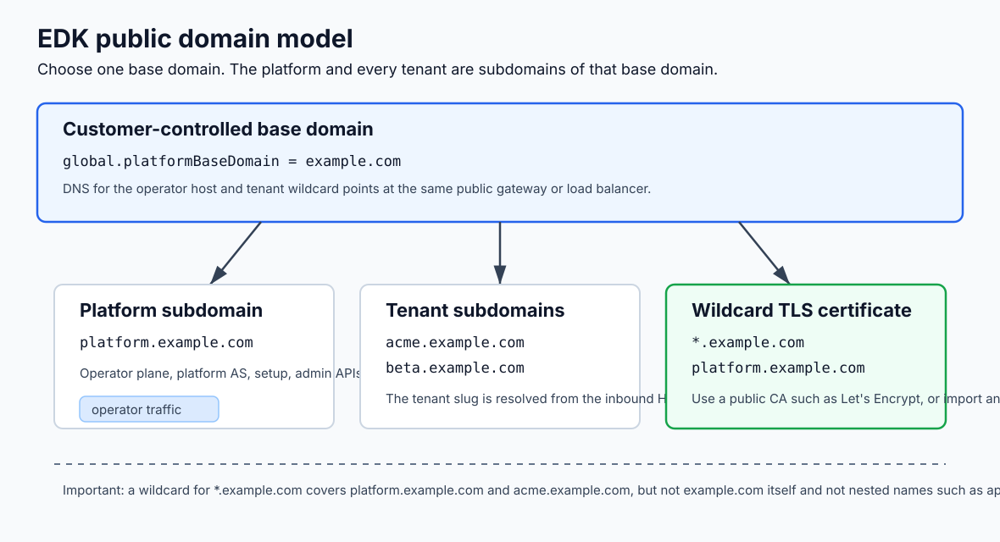

# Sphereon EDK Enterprise Deployment Kit

This kit deploys the Sphereon EDK enterprise platform from published container images. It contains the Helm chart, a Docker Compose stack, gateway TLS helpers, and optional scripts/Postman assets for validating first-run setup and tenant onboarding.

You run published images only. The kit does not build anything. Customer deployments use the public Enterprise Development Kit Deployment repository: <https://github.com/Sphereon-Opensource/Enterprise-Development-Kit-Deployment>.

## What you deploy

The deployment runs these backing images. They are not customer URLs; customers
and operators enter only through the platform host and tenant gateway hosts. The
gateway maps host/path routes to the backing containers internally.

| Image | Backing responsibility |
| --- | --- |
| `nexus.sphereon.com/edk-docker/enterprise-platform` | Central control plane: first-run setup, license activation, platform admin, platform configuration, and platform authorization server |
| `nexus.sphereon.com/edk-docker/enterprise-tenant-kms` | Key management for all services |
| `nexus.sphereon.com/edk-docker/enterprise-did` | DID resolver and `did:web` hosting |
| `nexus.sphereon.com/edk-docker/enterprise-tenant-as` | Tenant OAuth2 authorization server |
| `nexus.sphereon.com/edk-docker/enterprise-issuer` | OID4VCI credential issuer |
| `nexus.sphereon.com/edk-docker/enterprise-verifier` | OID4VP credential verifier |

The platform and tenant-KMS containers also run internal gRPC receivers. DID, tenant-AS, issuer, verifier, and tenant-KMS call the platform service over internal gRPC for platform configuration and control-plane data. DID, tenant-AS, issuer, and verifier call tenant-KMS over internal gRPC for KMS operations. gRPC is east-west only and must never be routed through the public gateway.

The customer-visible surface is the gateway route table, not backing services or
container ports. It is limited to `platform.<base-domain>` for the
operator/admin plane and `<tenant>.<base-domain>` for tenant protocol and
authenticated management paths. Runtime probes such as `/health` and `/ready`
are orchestration concerns inside Docker Compose or Kubernetes and are not part
of the customer route contract. Every
administrative REST path (`/api/.../v1`) is internal or
operator-authenticated and must be protected by JWT or service-mesh policy.

One optional container completes the platform:

| Image | Role | Public ingress |
| --- | --- | --- |
| `nexus.sphereon.com/edk-docker/admin-console` | Next.js operator admin console served under `/admin-console` | `/admin-console` on the platform host only |

The admin console is a separate Next.js app built and published by Sphereon, not from this kit. The gateway routes `https://platform.<base-domain>/admin-console` to it. After first-run setup activates the license and creates the operator account, operators sign in there with that account. The per-tenant console (`https://<tenant>.<base-domain>/admin-console`) is a future capability and is not enabled. Do not enable it until a per-tenant API authorization proxy enforces tenant isolation: the gateway only routes, it does not stop a tenant principal from reaching platform-admin APIs or another tenant's data.

## Domain and TLS model

Every EDK installation is anchored on one customer-controlled base domain. The platform is a subdomain of that base domain, and tenants are sibling subdomains:

- Base domain: `example.com`
- Platform/operator host: `platform.example.com`
- Tenant hosts: `<tenant-slug>.example.com`, for example `acme.example.com`

The platform and tenants are not separate DNS zones in the application model. They are subdomains under the same base domain, and tenant resolution depends on the inbound `Host` header. Your gateway, ingress controller, CDN, or load balancer must forward the original public Host header unchanged.



Terminate TLS at the public gateway or load balancer with a certificate that
covers the platform host and all first-level tenant hosts. The recommended
operational model is one wildcard certificate for `*.<base-domain>`. A public
CA such as Let's Encrypt is fine; in Kubernetes, issue it with cert-manager
DNS-01 or import an existing wildcard certificate as a TLS Secret. A wildcard
for `*.example.com` covers `platform.example.com` and `acme.example.com`, but it
does not cover the apex `example.com` or nested names such as
`api.acme.example.com`. The apex/base domain is not exposed by the standard EDK
gateway model.

## Prerequisites

- Nexus credentials for the published `nexus.sphereon.com/edk-docker/enterprise-*` and `nexus.sphereon.com/edk-docker/admin-console` images for the selected `EDK_TAG`.
- Docker Compose pins the enterprise image repository to `nexus.sphereon.com/edk-docker`; only the tag is configurable. Do not reintroduce `sphereon` or `docker.io/sphereon`, because those names resolve to public Docker Hub and are not EDK enterprise image locations.
- A Sphereon protected license bundle ZIP, or access to your evaluation license issuer. The setup UI generates the license recipient key when it creates the license request and includes only its public key in that request. You import the protected bundle during platform setup, and setup must also create the first operator account. Evaluation bundles can include the test root CA material when needed.
- TLS material for the operator and tenant hosts. Use one wildcard certificate
  for `*.<base-domain>`, or individual certificates for every tenant host and
  the operator host. The wildcard model is recommended because tenants are
  hosted as `<tenant>.<base-domain>` and can be onboarded without per-tenant
  certificate work.
- Two PostgreSQL databases: one platform/control-plane database and one tenant workload database. The Docker Compose stack starts separate local Postgres containers for evaluation. For Kubernetes or production-style deployments, use managed, operator-managed, or separately run databases and point the deployment at them with separate credentials Secrets or connection settings. Never put platform and tenant state in the same database in an enterprise deployment.

## Required Database Boundary

Every enterprise deployment needs two logical databases:

- `platform` database: platform/control-plane state, including tenant registry,
  routing, tenant gateway endpoint bindings, platform configuration, license/setup state, and
  the platform authorization server.
- `tenant` database: tenant workload state. The default deployment stores each
  tenant in its own schema inside this tenant database.

Do not collapse these into one PostgreSQL database, even with separate schemas.
The platform database and tenant database may run on the same PostgreSQL server
only when they remain separate database names with separate credentials and
network access rules. Satellite services never receive platform database
credentials; they read platform-owned configuration from the platform service
and use only the tenant workload database for runtime tenant data.

## Choose your path

### Docker Compose (evaluation, single node)

Use the stack under `compose/` to run the services on one machine. Run it two ways:

- The base file `compose/docker-compose.yml` alone publishes each service on its own loopback host port over plain HTTP for low-level local debugging only. The customer walkthroughs assume the gateway model below.
- The base file plus the gateway overlay `compose/docker-compose.gateway.yml` starts the platform, tenant AS, tenant KMS, DID, issuer, verifier, admin console, and Traefik gateway. The gateway routes by host and path on a single TLS port. The operator plane is `https://platform.<base-domain>`; tenant protocol URLs are bound during onboarding as `https://<tenant-slug>.<base-domain>`. For local evaluation, first generate a wildcard certificate with `scripts/gen-local-wildcard-cert.ps1` (Windows) or `scripts/gen-local-wildcard-cert.sh` (Linux/macOS), then trust the local CA.

Follow [docs/quickstart-docker.md](docs/quickstart-docker.md).

### Kubernetes (production)

Use the Helm chart under `helm/edk-enterprise/` for production. The chart renders deployments, services, ingress (or a single-port Gateway API front door), NetworkPolicies, and security defaults for the platform, runtime services, and admin console. The gateway examples under `helm/edk-enterprise/examples/` cover Cilium, GKE, AWS ALB, and Azure AGIC.

Follow [docs/quickstart-kubernetes.md](docs/quickstart-kubernetes.md).

## First-run setup and tenant onboarding

Once the full stack is up, complete first-run setup at
`https://platform.<base-domain>/setup-license` or through the setup API. Setup
generates the license request, imports the protected license bundle, and creates
the first platform operator account. After that, sign in at
`https://platform.<base-domain>/admin-console` and create tenants from the admin
console or platform admin API.

Tenant registration creates the default AS, KMS, DID, issuer, verifier, and
gateway route metadata through the already-running workload services. The
`scripts/provision` helper and Postman collection call the same APIs and are
provided as optional validation and automation tools.

Follow [docs/onboarding.md](docs/onboarding.md).

## Repository map

```
Enterprise-Development-Kit-Deployment/
  README.md                       This file
  docs/
    quickstart-docker.md          Bring the stack up with Docker Compose
    quickstart-kubernetes.md      Install the Helm chart on Kubernetes
    onboarding.md                 First-run setup, tenant creation, and optional validation helpers
    tls-and-gateway.md            Single-port TLS, gateway, and ingress options
    configuration.md              Configuration inputs and public hostnames
    secret-backends.md            Secret backend selection
    troubleshooting.md            Common problems and checks
  compose/
    docker-compose.yml            Base stack: enterprise services on individual host ports
    docker-compose.gateway.yml    Overlay: single TLS port behind a Traefik gateway
    .env.example                  Environment template (copy to .env)
    config/                       Per-service configuration templates
    gateway/
      traefik/                    Traefik static and dynamic gateway configuration
      certs/                      Local wildcard certificate output (generated)
  helm/
    edk-enterprise/               Helm chart for the enterprise services and admin console
      values.yaml                 Default values
      values.schema.json          Values schema
      README.md                   Chart reference (values, security, ingress)
      examples/                   Ready-to-copy values overlays (incl. gateway and admin-console examples)
      templates/                  Chart templates
  scripts/
    provision.ps1                 Optional setup and tenant onboarding validation over REST (Windows)
    provision.sh                  Optional setup and tenant onboarding validation over REST (Linux/macOS)
    gen-local-wildcard-cert.ps1   Local-evaluation wildcard TLS cert for the gateway (Windows)
    gen-local-wildcard-cert.sh    Local-evaluation wildcard TLS cert for the gateway (Linux/macOS)
  postman/
    EDK-Enterprise-Deployment.postman_collection.json
    EDK-Enterprise-Deployment.customer.postman_environment.json
```
