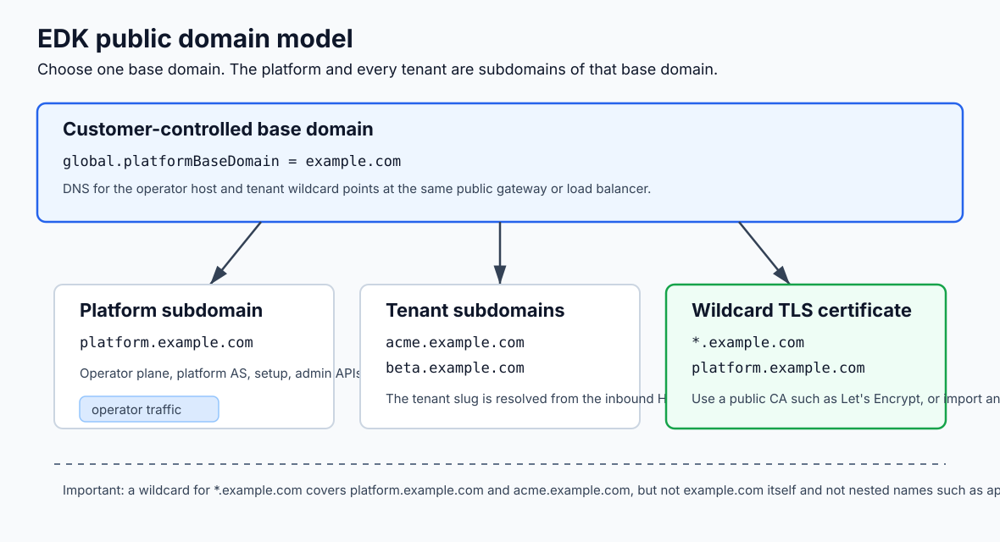

# EDK Enterprise Deployment Kit

This repository installs the EDK enterprise platform from published container
images. It contains a Docker Compose stack for evaluation and controlled
single-node use, a Helm chart for Kubernetes, gateway and TLS configuration,
and optional validation tools. It does not build application images.

Use the approved release tag and release artifacts supplied through your EDK
distribution channel. The public deployment repository is
<https://github.com/Sphereon-Opensource/Enterprise-Development-Kit-Deployment>.

All commands in this README start in the repository root unless a command says
otherwise.

## Choose an installation path

| Installation path | Intended use | Public entry point |
| --- | --- | --- |
| Docker Compose | Use this path for evaluation, development, and controlled single-node installations. | Traefik serves `https://platform.<base-domain>` and `https://<tenant>.<base-domain>` on one TLS port. |
| Helm | Use this path for production Kubernetes installations. | A Gateway API implementation serves `https://platform.<base-domain>` and `https://<tenant>.<base-domain>` on one TLS port. |

Do not expose the backing service ports as customer endpoints. The supported
public contract is the platform host plus registered tenant hosts.

## Default services

The standard installation uses eight published images. The admin console image
runs as separate platform and tenant processes, but it is still one image.

| Image | Responsibility |
| --- | --- |
| `nexus.sphereon.com/edk-docker/enterprise-platform` | This image runs the control plane, first-run setup, license activation, platform administration, platform configuration, and the platform authorization server. |
| `nexus.sphereon.com/edk-docker/enterprise-tenant-kms` | This image owns tenant key-management operations. |
| `nexus.sphereon.com/edk-docker/enterprise-did` | This image resolves DIDs and serves tenant `did:web` documents. |
| `nexus.sphereon.com/edk-docker/service-data` | This image stores tenant blobs and branding data on a separate durable volume. |
| `nexus.sphereon.com/edk-docker/enterprise-tenant-as` | This image runs tenant OAuth 2.0 and OpenID Connect authorization servers. |
| `nexus.sphereon.com/edk-docker/enterprise-issuer` | This image runs OID4VCI credential issuers. |
| `nexus.sphereon.com/edk-docker/enterprise-verifier` | This image runs OID4VP verifiers. |
| `nexus.sphereon.com/edk-docker/admin-console` | This image runs the platform admin console and the isolated tenant admin and testing console. |

The Helm chart also defines optional wallet-unit and wallet-interaction
workloads. They are disabled by default and are not part of the Docker Compose
stack. Enabling them requires their published images, secret-authority Secrets,
service configuration, and any required persistent storage.

The platform and tenant KMS expose internal gRPC receivers. Runtime services
use authenticated east-west gRPC calls for platform configuration and KMS
operations. These gRPC endpoints must remain inside the Compose network or
Kubernetes cluster.

## Use the customer Postman collection

Import these two files into Postman after the selected Compose or Helm
installation is running:

- `postman/EDK-Enterprise-Deployment.postman_collection.json`
- `postman/EDK-Enterprise-Deployment.customer.postman_environment.json`

Set `baseDomain` and `tenantSlug`; every URL follows from those two. The
collection has one folder per identity: the platform operator lists or registers
tenants, the tenant owner creates a service client, and the tenant APIs run with
that service client's client-credentials token. Each folder gets its token from
Postman's OAuth2 dialog. Optional folders cover Azure Key Vault and a wallet login
through your own Keycloak. See the [Postman guide](postman/README.md).

## Domain, DNS, and TLS model

Every installation uses one customer-controlled base domain. The platform and
tenant hosts are first-level subdomains of that base domain.

- The platform host is `platform.<base-domain>`.
- A tenant host is `<tenant-slug>.<base-domain>`.
- A wildcard certificate for `*.<base-domain>` covers the platform host and all
  first-level tenant hosts.
- The wildcard does not cover the base domain itself or nested names such as
  `api.tenant.<base-domain>`.

Point `platform.<base-domain>` and the traffic wildcard
`*.<base-domain>` at the public gateway. Tenant resolution depends on the
original HTTP `Host` header, so every proxy, load balancer, CDN, and gateway in
front of EDK must preserve that header.

For Let's Encrypt wildcard certificates, use DNS-01 validation. The ACME TXT
record at `_acme-challenge.<base-domain>` is separate from the traffic wildcard
record. See [TLS and gateway configuration](docs/tls-and-gateway.md) before
using a public domain.



## Shared requirements

- Obtain Nexus credentials for the approved enterprise image tag.
- Obtain the protected license bundle that will be imported during first-run
  setup.
- Choose the installation base domain before generating gateway or TLS
  configuration.
- Generate every credential independently. Do not reuse database passwords,
  keystore passwords, service client secrets, issuer pipeline keys, or
  secret-authority private keys.
- Keep platform control-plane data and tenant workload data in two separate
  PostgreSQL databases. They may use one PostgreSQL server, but they must have
  different database names, credentials, and authorization boundaries.
- Keep `.env`, generated private keys, Kubernetes Secret manifests, protected
  license bundles, and database backups out of Git and support bundles.

## Install with Docker Compose

Docker Compose starts separate local PostgreSQL containers for the platform
database and tenant database. This bundled database layout is intended for
evaluation. A maintained single-node installation should use separately
managed PostgreSQL databases and preserve the same platform and tenant
boundary.

### Compose requirements

- Install Docker with Compose v2.
- Install a Windows-native `openssl.exe` on Windows, or OpenSSL on Linux or
  macOS.
- Make TCP ports `80` and `443` available when using a gateway overlay.
- Make enough memory available for the seven backend services, two admin-console
  processes, two PostgreSQL containers, Traefik, and the telemetry containers.

### 1. Create the environment file

On Windows PowerShell, copy the template with:

```powershell
Copy-Item .\compose\.env.example .\compose\.env
```

On Linux or macOS, copy it with:

```bash
cp ./compose/.env.example ./compose/.env
```

Set the two values that only you can choose:

| Variable | Value |
| --- | --- |
| `EDK_TAG` | The exact approved image tag. Do not use `latest` or a snapshot tag. |
| `EDK_PLATFORM_BASE_DOMAIN` | The customer-controlled base domain. Use `saas.localtest.me` only for the local evaluation path. |

Keep `EDK_DEPLOYMENT_MODE=prod` and leave `EDK_OWNER_INITIAL_CREDENTIAL` empty
for a customer installation. First-run setup creates the operator account.
Every other value in the template is either generated in the next step or has a
working default. The comments in `compose/.env.example` describe each one.

### 2. Generate the keys and secrets

The platform signs secret-use permits and each workload signs its own execution
assertions. Generate this secret-authority key set first.

On Windows PowerShell, run:

```powershell
.\scripts\generate-secret-authority-keys.ps1 `
  -OutputDirectory .\compose\.secret-authority\current
```

On Linux or macOS, run:

```bash
./scripts/generate-secret-authority-keys.sh \
  ./compose/.secret-authority/current
```

Then complete `compose/.env`. Node.js 20 or later is required:

```text
node ./scripts/generate-compose-secrets.mjs
```

The script fills every empty secret with an independent random value: database
and role passwords, the keystore password, internal service client secrets,
the admin console client secret, the issuer pipeline keys, and the federation
session key. It also copies
the four `SECRET_AUTHORITY_*` coordinates from
`compose/.secret-authority/current/window.env`. It never changes a value that
is already set, so it is safe to run again, and you may enter values from your
own secret manager before running it.

Keep `compose/.env` and `compose/.secret-authority/` private and back them up
together with the databases and keystore volumes. Do not run the
secret-authority generator again against an active installation unless you are
performing a planned key rotation.

### 3. Choose one Compose gateway mode

The base file and exactly one gateway overlay form the customer-facing stack.
Do not combine gateway overlays.

| Mode | Files | When to use it |
| --- | --- | --- |
| Local TLS evaluation | `docker-compose.yml` and `docker-compose.gateway.yml` | Use this mode with `EDK_PLATFORM_BASE_DOMAIN=saas.localtest.me`, the generated local CA, and the included Traefik routing configuration. |
| Existing public wildcard certificate | `docker-compose.yml` and the rendered `docker-compose.public-cert.yml` | Use this mode after rendering the public-domain routes and placing `wildcard.crt` and `wildcard.key` in `compose/gateway/certs/`. |
| Automated Let's Encrypt | `docker-compose.yml` and the rendered `docker-compose.letsencrypt.yml` | Use this mode when Traefik can complete ACME validation. Use DNS-01 for a wildcard certificate. |
| Base file only | `docker-compose.yml` | Use this mode only for loopback diagnostics. It exposes individual HTTP ports and is not a customer URL model. |

For a local TLS evaluation, generate and trust the local certificate.

On Windows PowerShell, run:

```powershell
.\scripts\gen-local-wildcard-cert.ps1 -Localtest
```

On Linux or macOS, run:

```bash
./scripts/gen-local-wildcard-cert.sh --localtest
```

Trust `compose/gateway/certs/local-ca.crt` in the operating system or browser.
For a public domain, follow
[the public Compose TLS procedure](docs/tls-and-gateway.md#a-real-base-domain-in-production)
before starting the stack. Changing only `EDK_PLATFORM_BASE_DOMAIN` is not
enough because Traefik file-provider routes contain literal hostnames.

Traefik also needs an `appnet` network alias for every tenant host that
containers must resolve through the gateway. Add the planned tenant aliases in
`docker-compose.gateway.yml` for the local path. When rendering a public
overlay, pass the comma-separated tenant slugs through `-TenantAliases` on
PowerShell or `--tenant-aliases` on Linux and macOS. Rerender and restart the
gateway before exposing a tenant slug that was not included earlier.

### 4. Authenticate, validate, and install

Sign in to the image registry:

```text
docker login nexus.sphereon.com
```

For the local gateway path, validate the fully merged Compose model before it
changes containers:

```text
docker compose --project-directory ./compose -f ./compose/docker-compose.yml -f ./compose/docker-compose.gateway.yml config --quiet
```

Use the install and upgrade wrapper. The wrapper validates the model, pulls the
published images, starts the services, waits for health checks, and records the
installed tag. When it finds an earlier 0.25.0 release candidate, it upgrades
directly to 0.25.0 (an RC1 installation passes through RC2 first) and refuses
a downgrade. Before upgrading an existing installation, run
`node ./scripts/generate-compose-secrets.mjs` once and follow
[Upgrading a Docker Compose installation to 0.25.0](docs/upgrade-0.25.0.md).

On Windows PowerShell, run:

```powershell
$Tag = '<approved-release-tag>'

.\scripts\upgrade-compose.ps1 `
  -ImageTag $Tag `
  -ComposeDir .\compose `
  -File @(
    '.\compose\docker-compose.yml',
    '.\compose\docker-compose.gateway.yml'
  )
```

On Linux or macOS, run:

```bash
TAG='<approved-release-tag>'

bash ./scripts/upgrade-compose.sh \
  --image-tag "$TAG" \
  --compose-dir ./compose \
  --file ./compose/docker-compose.yml \
  --file ./compose/docker-compose.gateway.yml
```

Replace `docker-compose.gateway.yml` with the one rendered public gateway
overlay when installing on a public domain. Keep the same file list for every
later status, stop, start, and upgrade command.

The wrapper stores non-secret deployment evidence below
`edk-compose-upgrade-backup` and keeps the installed tag in
`compose/.edk-installed-image-tag`. It does not create database backups. Take
backups of both databases before every upgrade.

Check the resulting containers with:

```text
docker compose --project-directory ./compose -f ./compose/docker-compose.yml -f ./compose/docker-compose.gateway.yml ps
```

On a new installation, workload health responses can report
`licenseStatus: MISSING` until first-run setup imports the protected license.
The containers must still be running.

### 5. Complete setup and use Postman

Open `https://platform.<base-domain>/setup-license`, import the protected
license bundle, and create the first platform operator account. Then import
the collection and environment named [above](#use-the-customer-postman-collection).
Set `baseDomain` to the same value as `EDK_PLATFORM_BASE_DOMAIN` and set
`tenantSlug` to the tenant you want to use. Run **1. Platform operator > Tenants**
to find or register that tenant, **2. Tenant owner** to create its service
client, and **3. Tenant APIs** to call the tenant services. The collection
generates a service client secret when it creates the client.

### 6. Stop or remove the Compose stack

Stop containers while keeping them and all data:

```text
docker compose --project-directory ./compose -f ./compose/docker-compose.yml -f ./compose/docker-compose.gateway.yml stop
```

Remove containers and networks while preserving named data volumes:

```text
docker compose --project-directory ./compose -f ./compose/docker-compose.yml -f ./compose/docker-compose.gateway.yml down
```

Adding `--volumes` deletes the bundled PostgreSQL data and keystore volumes.
Use it only when intentionally destroying the installation.

The detailed Compose guide is in
[docs/quickstart-docker.md](docs/quickstart-docker.md).

The customer Compose baseline creates no example operator and holds no cloud
credential. First-run setup creates only the administrator that the installer
enters. Tenants can connect their own Azure Key Vault or AWS KMS through the
platform configuration API, and the operator can declare one platform-shared
vault in the optional block at the end of `compose/.env.example`.

## Install with Helm

The Helm chart installs EDK workloads and their Kubernetes resources. It does
not install PostgreSQL, a Gateway API controller, DNS records, a wildcard TLS
Secret, or the required credential and secret-authority Secrets.

The baseline chart uses the persisted software KMS for secret-management
bootstrap. An external AWS KMS, Azure Key Vault, Vault, or another provider is
required only when the installation deliberately selects that integration.

### Helm requirements

- Configure `kubectl` for the target Kubernetes cluster.
- Install Helm 3 or Helm 4.
- Install a Gateway API implementation and choose an existing GatewayClass, or
  provide an approved external ingress and TLS design.
- Provide a default StorageClass or explicit existing claims for the platform
  and tenant KMS keystores.
- Provide two reachable PostgreSQL 15 or newer databases.
- Install OpenSSL, Node.js, and Bash on the administration host when using
  `scripts/upgrade-helm.sh`.
- Obtain `enterprise-image-set.json` with the release when the selected release
  requires immutable image provenance. The wrapper requires it for RC3, RC4,
  RC5 and 0.25.0 tags.

### 1. Create a maintained values file

Create `customer-values.yaml` outside the chart directory and keep it as the
installation's maintained configuration. Start with the following structure and
replace every example value.

```yaml
global:
  imageTag: "<approved-release-tag>"
  imagePullSecrets:
    - edk-registry-credentials
  platformBaseDomain: example.com

database:
  platform:
    host: platform-postgres.example.net
    port: 5432
    name: edk_platform
    existingSecret: edk-platform-postgres
    usernameKey: username
    passwordKey: password
  secretManagement:
    existingSecret: edk-secret-management-database
    adminPasswordKey: admin-password
    tenantPasswordKey: tenant-password
    runtimePasswordKey: runtime-password
  tenant:
    host: tenant-postgres.example.net
    port: 5432
    name: edk_tenant
    existingSecret: edk-tenant-postgres
    usernameKey: username
    passwordKey: password
    isolation: schema
    schemaPattern: "tenant_{id}"

platform:
  externalBaseUrl: https://platform.example.com
  onboarding:
    deploymentId: "<stable-installation-id>"
  bootstrap:
    automatic: false
    issuer: https://platform.example.com
    deploymentMode: prod

serviceIdentity:
  internalClientExistingSecret: edk-runtime-secrets
  clientSecretKeys:
    tenant-kms: kms-service-client-secret
    tenant-as: tenant-as-service-client-secret
    did: did-service-client-secret
    blob: blob-service-client-secret
    issuer: issuer-service-client-secret
    verifier: verifier-service-client-secret
    trust-domain-identifier: trust-domain-service-client-secret

keystore:
  existingSecret: edk-runtime-secrets
  passwordKey: keystore-password

portalBff:
  existingSecret: edk-runtime-secrets
  clientSecretKey: admin-console-portal-bff-secret

issuerPipeline:
  existingSecret: edk-issuer-pipeline-secrets
  masterKekKey: master-kek
  blindIndexKey: blind-index-key

federationSessionEncryption:
  existingSecret: edk-federation-session
  key: federation-session-encryption-key

secretAuthority:
  existingSecrets:
    platform: edk-secret-authority-platform
    tenant-kms: edk-secret-authority-tenant-kms
    tenant-as: edk-secret-authority-tenant-as
    did: edk-secret-authority-did
    blob: edk-secret-authority-blob
    issuer: edk-secret-authority-issuer
    verifier: edk-secret-authority-verifier

gateway:
  enabled: true
  className: "<installed-gateway-class>"
  operatorHost: platform
  baseDomain: example.com
  tls:
    mode: secret
    secretName: edk-wildcard-tls

ingress:
  legacy:
    enabled: false
```

`global.platformBaseDomain`, `platform.externalBaseUrl`,
`platform.bootstrap.issuer`, and `gateway.baseDomain` must describe the same
public installation. `platform.externalBaseUrl` and
`platform.bootstrap.issuer` must be identical.

The files under `helm/edk-enterprise/examples/` are focused overlays. They show
database, gateway, telemetry, or local-cluster choices, but they are not complete
production values files. Merge the relevant settings into the maintained site
file and review the result.

### 2. Create the namespace, registry Secret, and TLS Secret

The following commands show direct Kubernetes Secret creation. A production
cluster should normally create the same objects through its approved external
secret operator or deployment pipeline.

```bash
kubectl create namespace edk

kubectl -n edk create secret docker-registry edk-registry-credentials \
  --docker-server=nexus.sphereon.com \
  --docker-username='<registry-username>' \
  --docker-password='<registry-password>'

kubectl -n edk create secret tls edk-wildcard-tls \
  --cert='./wildcard.crt' \
  --key='./wildcard.key'
```

Use the namespace and Secret names selected in `customer-values.yaml`. If
`gateway.tls.mode` is `certManager` or `external`, follow the matching example
under `helm/edk-enterprise/examples/` instead of creating this TLS Secret.

### 3. Prepare both databases and their Secrets

Create separate platform and tenant databases before installing the chart. The
chart uses each database owner for deployment-time migrations. It never creates
the PostgreSQL servers or databases.

Create the fixed login roles `secret_management_admin` and
`secret_management_tenant_serving` in both PostgreSQL databases. The platform
service uses them in the platform database, and satellite services use them in
the tenant database. Both roles must be `NOSUPERUSER`, `NOCREATEDB`,
`NOCREATEROLE`, `NOINHERIT`, and `NOBYPASSRLS`. Grant `CONNECT` on the relevant
database and `USAGE` on the target schema. Do not grant schema ownership,
`CREATE`, role membership, superuser, or `BYPASSRLS`.

Create the credential Secrets with independent values:

```bash
kubectl -n edk create secret generic edk-platform-postgres \
  --from-literal=username='<platform-owner>' \
  --from-literal=password='<platform-owner-password>'

kubectl -n edk create secret generic edk-tenant-postgres \
  --from-literal=username='<tenant-owner>' \
  --from-literal=password='<tenant-owner-password>'

kubectl -n edk create secret generic edk-secret-management-database \
  --from-literal=admin-password='<secret-management-admin-password>' \
  --from-literal=tenant-password='<secret-management-tenant-password>' \
  --from-literal=runtime-password='<secret-management-runtime-password>'
```

The two passwords in `edk-secret-management-database` must match the fixed role
passwords in both databases. See
[secret management](docs/secret-management.md) for the runtime trust boundary.

### 4. Prepare runtime, issuer pipeline and federation session Secrets

`scripts/upgrade-helm.sh` creates `edk-runtime-secrets` and
`edk-issuer-pipeline-secrets` when they do not exist. It preserves existing
values and refuses partial or unsafe replacement during an upgrade. Create
`edk-federation-session` yourself in both cases.

When installing directly with Helm, create these objects before rendering:

```bash
kubectl -n edk create secret generic edk-runtime-secrets \
  --from-literal=kms-service-client-secret='<independent-random-secret>' \
  --from-literal=tenant-as-service-client-secret='<independent-random-secret>' \
  --from-literal=did-service-client-secret='<independent-random-secret>' \
  --from-literal=blob-service-client-secret='<independent-random-secret>' \
  --from-literal=issuer-service-client-secret='<independent-random-secret>' \
  --from-literal=verifier-service-client-secret='<independent-random-secret>' \
  --from-literal=trust-domain-service-client-secret='<independent-random-secret>' \
  --from-literal=admin-console-portal-bff-secret='<independent-random-secret>' \
  --from-literal=keystore-password='<independent-random-password>'

kubectl -n edk create secret generic edk-issuer-pipeline-secrets \
  --from-literal=master-kek='<32-byte-base64url-value>' \
  --from-literal=blind-index-key='<different-32-byte-base64url-value>'

kubectl -n edk create secret generic edk-federation-session \
  --from-literal=federation-session-encryption-key='<32-byte-standard-base64-value>'
```

The wallet-unit and wallet-interaction workloads are disabled by default and
need no keys. When you enable them, add
`wallet-unit-service-client-secret` and
`wallet-interaction-service-client-secret` to `edk-runtime-secrets`;
`scripts/upgrade-helm.sh` adds both automatically.

Do not rotate any of these values by deleting a Secret during an upgrade.
Coordinate credential and key rotation as a separate operation.

### 5. Prepare workload-isolated secret-authority Secrets

Every enabled backend workload needs its own secret-authority Secret. The
platform Secret contains the central permit private key and all assertion public
keys. Each satellite Secret contains only that workload's assertion private key
and the central permit public key.

Generate the key set for the default workloads.

On Windows PowerShell, run:

```powershell
.\scripts\generate-secret-authority-keys.ps1 `
  -OutputDirectory .\compose\.secret-authority\helm-current
```

On Linux or macOS, run:

```bash
./scripts/generate-secret-authority-keys.sh \
  ./compose/.secret-authority/helm-current
```

The default workloads are `service-platform`, `service-crypto`,
`service-data`, `service-blob`, `service-tenant-as`, `service-oid4vci`,
and `service-oid4vp`.

Use an approved secret operator or deployment pipeline to create the following
Secret data. Keep the key names exactly as shown in
`secretAuthority.keys` in the chart values.

| Kubernetes Secret | Required data |
| --- | --- |
| `edk-secret-authority-platform` | Store the four coordinate values from `window.env` under `central-permit-signing-key`, `central-assertion-verification-keys`, `satellite-assertion-signing-key`, and `satellite-permit-verification-keys`. Add `central-permit-signing.pem`, `central-permit.pub.pem`, the platform `assertion.pem`, and every generated `service-*-assertion.pub.pem` file. |
| `edk-secret-authority-tenant-kms` | Store the two satellite coordinate values, `workload/service-crypto/assertion.pem` as `assertion.pem`, and `public/central-permit.pub.pem` as `central-permit.pub.pem`. |
| `edk-secret-authority-tenant-as` | Store the two satellite coordinate values, `workload/service-tenant-as/assertion.pem` as `assertion.pem`, and `public/central-permit.pub.pem` as `central-permit.pub.pem`. |
| `edk-secret-authority-did` | Store the two satellite coordinate values, `workload/service-data/assertion.pem` as `assertion.pem`, and `public/central-permit.pub.pem` as `central-permit.pub.pem`. |
| `edk-secret-authority-blob` | Store the two satellite coordinate values, `workload/service-blob/assertion.pem` as `assertion.pem`, and `public/central-permit.pub.pem` as `central-permit.pub.pem`. |
| `edk-secret-authority-issuer` | Store the two satellite coordinate values, `workload/service-oid4vci/assertion.pem` as `assertion.pem`, and `public/central-permit.pub.pem` as `central-permit.pub.pem`. |
| `edk-secret-authority-verifier` | Store the two satellite coordinate values, `workload/service-oid4vp/assertion.pem` as `assertion.pem`, and `public/central-permit.pub.pem` as `central-permit.pub.pem`. |

The two satellite coordinate values are
`SECRET_AUTHORITY_SATELLITE_ASSERTION_SIGNING_KEY` and
`SECRET_AUTHORITY_SATELLITE_PERMIT_VERIFICATION_KEYS` from `window.env`. Store
their complete values under `satellite-assertion-signing-key` and
`satellite-permit-verification-keys`.

To enable wallet-unit or wallet-interaction, generate the key set with
`service-wallet-unit` and `service-wallet-interaction` added to the default
workloads, add their public keys to the platform Secret, create their isolated
Secrets the same way, and set the names under `secretAuthority.existingSecrets`.
The chart mounts wallet public keys only for enabled wallet workloads, or when
the installed platform Secret already holds them.

Do not commit the generated directory. Preserve the installed Kubernetes
Secrets through upgrades, and do not generate a new authority window as a
substitute for a missing Secret.

### 6. Validate and install the chart

Validate the values and inspect the rendered manifest before changing the
cluster:

```bash
helm lint ./helm/edk-enterprise \
  --values ./customer-values.yaml

helm template sphereon-edk-enterprise ./helm/edk-enterprise \
  --namespace edk \
  --values ./customer-values.yaml \
  > ./edk-rendered.yaml
```

Review image tags, database hosts, Secret names, public hosts, GatewayClass,
TLS mode, service exposure, persistent claims, and NetworkPolicies in the
rendered manifest.

For a fresh install or an upgrade on Linux or macOS, use the wrapper:

```bash
TAG='<approved-release-tag>'

bash ./scripts/upgrade-helm.sh \
  --release sphereon-edk-enterprise \
  --namespace edk \
  --values ./customer-values.yaml \
  --image-tag "$TAG" \
  --release-set-evidence ./enterprise-image-set.json
```

The wrapper requires `--release-set-evidence` for RC3, RC4, RC5 and 0.25.0 tags. The
file must match the selected tag and bind all eight default images to immutable
content and release provenance. Omit the option only when the selected release
does not require it.

The wrapper validates the chart, creates missing runtime and pipeline Secrets,
backs up the installed Helm state, quiesces the release, applies known release
transition overlays in order, installs without automatic rollback, and waits
for every Deployment. Add `--tenant-host <existing-tenant-host>` during an
upgrade when an existing tenant DID document should be checked after rollout.

After all prerequisite Secrets already exist, a fresh installation can also be
performed directly with Helm from any operating system:

```text
helm upgrade --install sphereon-edk-enterprise ./helm/edk-enterprise --namespace edk --values ./customer-values.yaml --wait --timeout 15m
```

Do not use the direct command to skip release-transition steps during an
upgrade. The wrapper applies the release transitions from any 0.25.0 release
candidate to 0.25.0 in order, including the one-time Deployment strategy
conversion, and refuses a downgrade. See
[the Kubernetes quickstart](docs/quickstart-kubernetes.md) for release-specific
upgrade details.

### 7. Verify the Kubernetes installation

Inspect the release and cluster events:

```bash
helm status sphereon-edk-enterprise --namespace edk
kubectl -n edk get deployments,pods,services
kubectl -n edk get gateway,httproute
kubectl -n edk get events --sort-by=.lastTimestamp
```

A render-time error that names an empty `secretAuthority.existingSecrets`,
`serviceIdentity.internalClientExistingSecret`, `keystore.existingSecret`,
`portalBff.existingSecret`, `issuerPipeline.existingSecret`, or
`federationSessionEncryption.existingSecret` means the values
file is incomplete. A pod in `CreateContainerConfigError` usually means the
referenced Secret object or key does not exist in the release namespace.

## First-run setup and tenant onboarding

After either installation path is running, open:

```text
https://platform.<base-domain>/setup-license
```

The setup flow generates the license request, imports the protected license
bundle, and creates the first platform operator account. After setup completes,
sign in at:

```text
https://platform.<base-domain>/admin-console
```

Create the first tenant from the platform admin console or platform admin API.
Tenant registration creates the default authorization server, KMS, DID,
issuer, verifier, and gateway endpoint bindings through the running workload
services.

Verify the tenant through its public gateway host:

```text
https://<tenant>.<base-domain>/.well-known/did.json
https://<tenant>.<base-domain>/.well-known/openid-credential-issuer
https://<tenant>.<base-domain>/admin-console
```

The `scripts/provision` helpers and the Postman collection call the same APIs
and are optional validation tools. See
[first-run setup and onboarding](docs/onboarding.md).

## Upgrade and rollback rules

- Pin one approved immutable image tag across the complete release.
- Back up both PostgreSQL databases before every Compose or Helm upgrade.
- Keep the platform and tenant KMS persistent volumes or claims with the
  release.
- Preserve existing runtime, pipeline, TLS, database, and secret-authority
  Secrets. Do not regenerate missing credentials during an upgrade.
- Before a Compose upgrade, run `node ./scripts/generate-compose-secrets.mjs`
  once. It adds the secrets a newer release requires, such as
  `EDK_FEDERATION_SESSION_ENCRYPTION_KEY`, and leaves existing values
  unchanged. It also names any value copied from an earlier published
  template, such as the former example issuer pipeline keys; rotate those in a
  planned maintenance window.
- Use the Compose or Helm wrapper so known release transitions run in order.
  Upgrade an RC4 Compose installation directly to 0.25.0, not through RC5; see
  [Upgrading a Docker Compose installation to 0.25.0](docs/upgrade-0.25.0.md).
- Do not treat a Helm manifest backup as a database backup.
- If a Helm upgrade fails after database migration starts, keep the workloads
  stopped. Restore both pre-upgrade database snapshots before an explicit Helm
  rollback or retry.

The supported RC2 to RC3 upgrade path uses PostgreSQL. MySQL installations
start fresh at RC3 and have no earlier supported upgrade lineage.

## Documentation map

| Document | Purpose |
| --- | --- |
| [Docker Compose quickstart](docs/quickstart-docker.md) | This document provides the detailed Compose setup and gateway procedure. |
| [Compose upgrade to 0.25.0](docs/upgrade-0.25.0.md) | This document lists the changes and manual steps for upgrading an RC4 or RC5 Compose installation. |
| [Kubernetes quickstart](docs/quickstart-kubernetes.md) | This document provides chart examples and release-specific Helm upgrade details. |
| [Helm chart reference](helm/edk-enterprise/README.md) | This document describes chart values, services, security controls, and render checks. |
| [TLS and gateway configuration](docs/tls-and-gateway.md) | This document explains local certificates, public certificates, Let's Encrypt, Gateway API, and host routing. |
| [Configuration](docs/configuration.md) | This document explains configuration ownership, public URLs, and service settings. |
| [Secret management](docs/secret-management.md) | This document explains secret storage, database roles, provider egress, and runtime trust boundaries. |
| [First-run setup and onboarding](docs/onboarding.md) | This document explains license setup, operator creation, tenant registration, and optional validation helpers. |
| [Troubleshooting](docs/troubleshooting.md) | This document lists common image, Secret, database, routing, TLS, and startup failures. |
