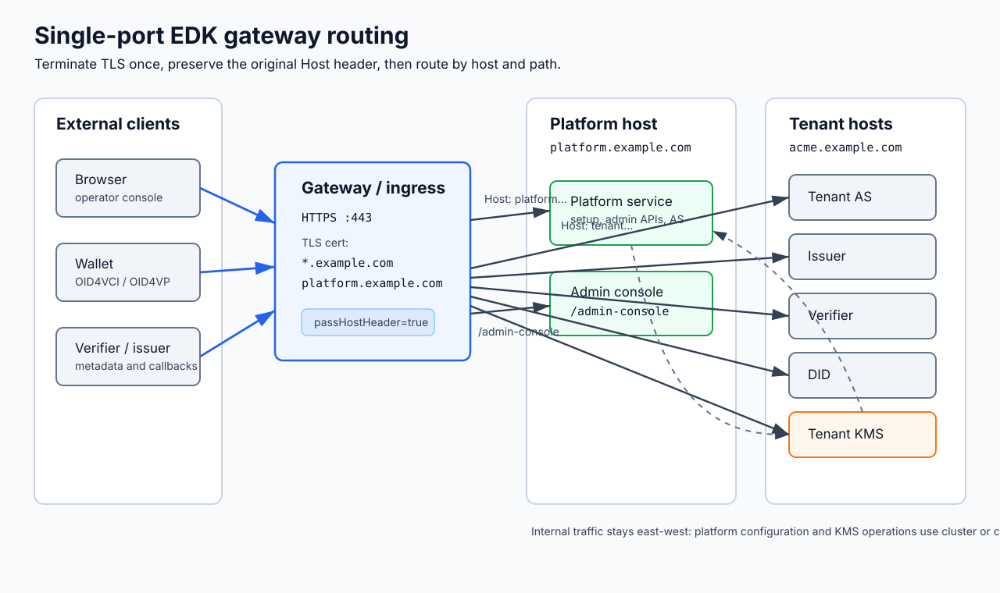

# TLS and the single-port gateway

The deployment is multi-tenant by subdomain. Every installation has one base
domain, the platform lives at `platform.<base-domain>`, and each tenant lives at
`<tenant-slug>.<base-domain>`. For example, with `example.com` as the base
domain, the platform is `platform.example.com` and tenant `acme` is
`acme.example.com`.

The front door terminates TLS for the platform host and every tenant host on a
single port, then routes by host and path to each service. Tenant resolution
reads the inbound Host header, so that header is part of the application
contract.



Use one wildcard certificate for `*.<base-domain>`, or individual certificates
for the operator host and every tenant host. The wildcard model is recommended
because new tenants are hosted as `<tenant-slug>.<base-domain>` and otherwise
require certificate automation before they can go live. The wildcard covers
`platform.<base-domain>` and first-level tenant hosts; it does not cover the
apex/base domain.

This page covers the single-port front door in both Docker and Kubernetes, and
the public versus internal split. For the configuration inputs such as the base
domain and internal service wiring, see [configuration.md](configuration.md).

## Host preservation

Tenant resolution reads the raw inbound Host header. The front door must forward
the original public Host unchanged to the backend. A gateway, ingress
controller, CDN, or load balancer that rewrites Host to the backend pool or
service name makes every request resolve to the wrong tenant or to none, and
tenant routing breaks. Verify with a request to a tenant host that the backend
sees the original Host, not a pod or service name.

## Public versus internal split

Public exposure is limited to host/path routes through the gateway:

- `platform.<base-domain>` for the operator/admin plane and platform OAuth/OIDC
  paths.
- `<tenant>.<base-domain>` for DID resolver paths, tenant OAuth/OIDC paths,
  OID4VCI issuer paths, OID4VP verifier paths, and authenticated operator/admin
  API paths when your policy intentionally exposes them.
- The complete admin console at `/admin-console` on the platform host, plus the
  canonical `/testing-console/{kind}/{instanceId}` page and isolated
  protocol-BFF/static support paths on registered issuer/verifier hosts.

Those are gateway or ingress routes. Customers and operators do not call the
workload containers directly. Runtime probes are for Docker Compose or
Kubernetes orchestration only and must not be exposed as tenant public routes.

Administrative REST under `/api/.../v1` is not anonymous public traffic. In
Kubernetes the chart can enforce a public/internal split with separate ingress
classes, or route selected management paths through the single-port Gateway API.
In Docker, the gateway overlay routes only the paths it lists; do not publish
workload host ports. Any management route must be operator-authenticated and
protected by network policy.

## Docker single-port gateway

The Compose stack ships a gateway overlay at `compose/docker-compose.gateway.yml` that puts a Traefik reverse proxy in front of the services. Bring the full base stack and the overlay up together:

```bash
docker compose -f docker-compose.yml -f docker-compose.gateway.yml up -d
```

Traefik terminates TLS on `443`, redirects `80` to `443`, and fans out to the services by host and path with `passHostHeader: true`, so the inbound Host reaches the backend unchanged. The static configuration is in `compose/gateway/traefik/traefik.yml` and the routing table is in `compose/gateway/traefik/dynamic.yml`.

This starts the platform and all workload containers. On a pristine deployment,
tenant AS, tenant KMS, DID, issuer, and verifier may report license-gated health
until first-run setup imports the protected license bundle, but they should be
present before tenant onboarding starts.

### Local evaluation certificate

For local evaluation, generate a wildcard certificate with the kit script:

```bash
scripts/gen-local-wildcard-cert.sh
```

On Windows use `scripts\gen-local-wildcard-cert.ps1`. The script writes to `compose/gateway/certs/`:

- `wildcard.crt` and `wildcard.key`. The server certificate for `*.saas.localtest.me` (the default base domain) and the operator host, mounted into Traefik.
- `local-ca.crt`. The local CA. Trust it in your operating system, browser, and wallet to avoid certificate warnings.
- `local-truststore.p12`. A PKCS#12 truststore holding the CA (password `changeit`), mounted into the containers so they trust the gateway when fetching per-tenant JWKS over TLS.

The script uses `mkcert` when available (run `mkcert -install` once so your browser trusts the CA) and otherwise falls back to a self-signed openssl CA you trust manually. Override the base domain with `EDK_PLATFORM_BASE_DOMAIN` and the truststore password with `EDK_TRUSTSTORE_PASSWORD`. Re-run any time; it overwrites the cert material.

The local default base domain is `saas.localtest.me`, whose subdomains resolve
to `127.0.0.1` with no DNS setup, so
`https://platform.saas.localtest.me` and
`https://<tenant>.saas.localtest.me` reach the gateway on your machine.

### A real base domain in production

For a real base domain, supply publicly trusted certificate material instead of
the local-evaluation material. The recommended form is one wildcard certificate
for `*.<your-base>`, which covers `platform.<your-base>` and first-level tenant
hosts. The certificate can come from Let's Encrypt or any other public CA; with
Let's Encrypt, use DNS-01 validation for wildcard issuance. Place the
certificate and key in
`compose/gateway/certs/` as `wildcard.crt` and `wildcard.key`, and remove the
local-evaluation truststore mounts from the overlay, since a publicly trusted
certificate is validated against the default runtime truststore. If you use
individual certificates instead, update the Traefik TLS configuration to load
the certificate for every tenant host and the platform host before exposing
those hosts.

The Traefik routing table reads the base domain literally; its file provider
does not interpolate environment variables. For a public static certificate,
render the public-cert overlay with the same base domain so the generated
Traefik routing table matches the certificate and DNS. Point public DNS for
`platform.<base-domain>` and `*.<base-domain>` at the machine that runs the
gateway.

### Let's Encrypt gateway for public evaluation

The Docker kit also includes a Let's Encrypt gateway renderer for public
evaluation on a real base domain. Use this when `platform.<base-domain>` and
`*.<base-domain>` resolve to the machine running Docker and inbound TCP `443`
reaches that machine.

Render the overlay on Windows:

```powershell
.\scripts\start-letsencrypt.ps1 `
  -BaseDomain edk.example.com `
  -Email admin@example.com `
  -Challenge tls-alpn
```

Render it on Linux or macOS:

```bash
scripts/start-letsencrypt.sh \
  --base-domain edk.example.com \
  --email admin@example.com \
  --challenge tls-alpn
```

The script writes these generated files:

- `compose/docker-compose.letsencrypt.yml`
- `compose/gateway/traefik/traefik.letsencrypt.generated.yml`
- `compose/gateway/traefik/dynamic.letsencrypt.generated.yml`

Start the stack with the generated overlay:

```bash
cd compose
docker compose -f docker-compose.yml -f docker-compose.letsencrypt.yml up -d --wait
```

The default renderer uses the Let's Encrypt production ACME endpoint.

`tls-alpn` validation is the simplest mode and only requires inbound TCP `443`.
It can issue only concrete DNS names, not `*.<base-domain>`. The renderer requests
one certificate for `platform.<base-domain>` plus the comma-separated tenant
aliases passed through `-TenantAliases` / `--tenant-aliases`. No tenant aliases
are rendered by default. Add every tenant hostname you want covered before
starting Traefik, or rerender and restart before exposing a new tenant host. For
an actual wildcard certificate that covers arbitrary future tenants, use DNS-01.
With an automated DNS provider, Traefik can request and renew the certificate
itself. Cloudflare example:

```powershell
$env:CF_DNS_API_TOKEN = "<token>"
.\scripts\start-letsencrypt.ps1 `
  -BaseDomain edk.example.com `
  -Email admin@example.com `
  -Challenge dns `
  -DnsProvider cloudflare
```

### Subdomain wildcard with Let's Encrypt

Use the installation subdomain as the EDK base domain when the desired
certificate is scoped below a parent domain. For example, to run EDK under
`*.edk.example.com`, set the base domain to `edk.example.com`. The platform host
becomes `platform.edk.example.com` and tenants become
`<tenant>.edk.example.com`.

This mode must use DNS-01. Let's Encrypt cannot issue wildcard certificates with
HTTP-01 or TLS-ALPN-01 validation. The ACME client must be able to create TXT
records at `_acme-challenge.<base-domain>` in the authoritative DNS zone. This
ACME challenge record is separate from the normal traffic records that point
`platform.<base-domain>` and `*.<base-domain>` at the gateway host or load
balancer. Keep the traffic wildcard DNS record in place. A deliberate
`_acme-challenge` delegation can also work, but the direct manual-DNS path uses
an explicit TXT record at `_acme-challenge.<base-domain>`.

For Cloudflare-managed DNS, create a scoped token with zone read and DNS edit
rights for the zone that contains the EDK base domain, then render with:

```powershell
$env:CF_DNS_API_TOKEN = "<cloudflare-token>"
.\scripts\start-letsencrypt.ps1 `
  -BaseDomain edk.example.com `
  -Email admin@example.com `
  -Challenge dns `
  -DnsProvider cloudflare
```

```bash
export CF_DNS_API_TOKEN="<cloudflare-token>"
scripts/start-letsencrypt.sh \
  --base-domain edk.example.com \
  --email admin@example.com \
  --challenge dns \
  --dns-provider cloudflare
```

The generated Traefik configuration requests only `*.<base-domain>` by default.
That wildcard covers `platform.<base-domain>` and first-level tenant hosts such
as `acme.<base-domain>`. It does not cover the base domain itself or nested
names such as `api.acme.<base-domain>`. If you also expose the base domain for
some separate purpose, pass `-IncludeBaseDomain` or `--include-base-domain` to
request both the base domain and the wildcard.

The `-Email` / `--email` value registers the Let's Encrypt ACME account and is
used for certificate expiry or operational notices. It does not have to be a
mailbox on the base domain, but it should be a monitored operational address.

### Manual DNS-01

If you can edit DNS manually but do not have an API token for an automated DNS
provider, use an external ACME client to obtain the wildcard certificate first.
Traefik cannot complete or renew manual DNS-01 interactively during Compose
startup.

Render the public static-certificate overlay:

```powershell
.\scripts\start-letsencrypt.ps1 `
  -BaseDomain edk.example.com `
  -Email admin@example.com `
  -Challenge dns
```

The script prints an external ACME command such as:

```powershell
certbot certonly --manual --preferred-challenges dns --agree-tos --no-eff-email --email admin@example.com -d "*.edk.example.com"
```

When the ACME client prompts for DNS-01 validation, create the TXT value at
`_acme-challenge.<base-domain>`, wait for propagation, and continue the ACME
client. Do not remove the normal `*.<base-domain>` traffic wildcard record; it
is unrelated. If DNS lookup shows a CNAME at `_acme-challenge.<base-domain>`
only because the traffic wildcard is being expanded, creating the explicit TXT
record at `_acme-challenge.<base-domain>` stops that wildcard expansion for the
challenge name. Remove a CNAME only when it is an explicit record at the exact
`_acme-challenge.<base-domain>` owner and it is not an intentional ACME
delegation managed by your DNS team. Then copy the issued certificate files into
the Compose cert directory:

```text
fullchain.pem -> compose/gateway/certs/wildcard.crt
privkey.pem   -> compose/gateway/certs/wildcard.key
```

Start with the rendered public static-certificate overlay:

```bash
cd compose
docker compose -f docker-compose.yml -f docker-compose.public-cert.yml up -d --wait
```

Manual DNS-01 does not give Traefik automated renewals. Before the certificate
expires, renew with the external ACME client, replace `wildcard.crt` and
`wildcard.key`, and restart Traefik or the stack.
The DNS token is the sensitive part: prefer a narrowly scoped API token and do
not commit it to `.env`, Compose files, shell history, or support bundles.

The Let's Encrypt overlay replaces `docker-compose.gateway.yml`; do not combine
both gateway overlays. Because the certificate is publicly trusted, this overlay
does not mount `compose/gateway/certs` into the containers and does not set a
runtime truststore override.

## Kubernetes single-port gateway

In Kubernetes the single-port front door uses the Gateway API. One wildcard
HTTPS listener terminates TLS for the operator host and all tenant hosts;
HTTPRoutes fan out by host and path. Legacy Ingress objects are disabled so the
gateway is the only public entry point. The ready-to-copy examples live under
`helm/edk-enterprise/examples/`.

Common gateway settings under `gateway`:

| Key | Purpose |
| --- | --- |
| `gateway.enabled` | Render the Gateway and HTTPRoutes. |
| `gateway.className` | GatewayClass to bind to (cilium, a GKE class, an AWS Gateway API class). |
| `gateway.operatorHost` | Operator host label; the operator plane is `<operatorHost>.<baseDomain>`. |
| `gateway.baseDomain` | Wildcard base domain. Defaults to `global.platformBaseDomain`. |
| `gateway.tls.mode` | `secret` to reference an existing wildcard TLS Secret, or `certManager` to provision the wildcard through a cert-manager ClusterIssuer. Use DNS-01 for Let's Encrypt wildcard certificates. |
| `gateway.tls.secretName` | Wildcard TLS Secret name when `mode` is `secret`. |
| `gateway.tls.clusterIssuer` | ClusterIssuer name when `mode` is `certManager`. |
| `gateway.httpRedirect` | Add a port 80 listener and a redirect route that 301s to HTTPS. |

### Cilium Gateway API

```yaml
gateway:
  enabled: true
  className: cilium
  operatorHost: platform
  baseDomain: example.com
  tls:
    mode: secret
    secretName: edk-wildcard-tls
  httpRedirect: true

ingress:
  legacy:
    enabled: false
```

See `helm/edk-enterprise/examples/gateway-cilium-values.yaml`.

### GKE Gateway API

GKE Gateway preserves the inbound Host and sets `X-Forwarded-Proto` by default. For the wildcard certificate you either reference a pre-created Kubernetes TLS Secret (`tls.mode: secret`) or provision a Google-managed certificate for `*.<base-domain>` using DNS authorization and bind it to the Gateway with a `networking.gke.io/certmap` annotation.

```yaml
gateway:
  enabled: true
  className: gke-l7-global-external-managed
  operatorHost: platform
  baseDomain: example.com
  tls:
    mode: secret
    secretName: edk-wildcard-tls
  httpRedirect: true

ingress:
  legacy:
    enabled: false
```

See `helm/edk-enterprise/examples/gateway-gke-values.yaml`.

### AWS

Use the AWS Gateway API controller or another AWS front door that presents one
public HTTPS listener and preserves the inbound Host header. Set
`gateway.enabled` true, use the GatewayClass published in your cluster, and
disable legacy per-service Ingress rendering.

```yaml
gateway:
  enabled: true
  className: REPLACE-WITH-AWS-GATEWAY-CLASS
  operatorHost: platform
  baseDomain: example.com
  tls:
    mode: secret
    secretName: edk-wildcard-tls
  httpRedirect: true

ingress:
  legacy:
    enabled: false
```

Use one wildcard certificate for `*.<base-domain>`; it covers the operator host
and every tenant host.

### Azure

Use an Azure Gateway API implementation or an Application Gateway configuration
that presents one public HTTPS listener and preserves the inbound Host header.
Host preservation is mandatory: if the gateway rewrites Host to the backend pool
or service name, tenant resolution breaks.

```yaml
gateway:
  enabled: true
  className: REPLACE-WITH-AZURE-GATEWAY-CLASS
  operatorHost: platform
  baseDomain: example.com
  tls:
    mode: secret
    secretName: edk-wildcard-tls
  httpRedirect: true

ingress:
  legacy:
    enabled: false
```

Supply the wildcard certificate through the gateway implementation you use, for
example from Azure Key Vault or a Kubernetes TLS Secret.

## Admin console routing

The optional admin console is a Next.js app served under the `/admin-console`
path prefix on the platform host. The gateway routes
`https://platform.<base-domain>/admin-console` to the `admin-console` container
on port `3000`. The console owns the prefix and emits its assets under
`/admin-console/_next/...`, so the route is served **without** a StripPrefix:
forward the full path including `/admin-console` to the backend. Stripping the
prefix breaks asset loading.

The `/admin-console` route must take precedence over the platform catch-all so
that `/admin-console` requests reach the console and not the platform service.
Give the console route higher priority than the platform host route.

**Traefik (Compose).** The gateway overlay routes the `/admin-console` prefix on
the platform host to the `admin-console` service. The router matches
`Host(platform.<base-domain>) && PathPrefix(/admin-console)` with no StripPrefix
middleware, and is given a higher priority than the platform catch-all router so
the more specific path wins. The routing table lives in
`compose/gateway/traefik/dynamic.yml`.

**Kubernetes Gateway API / Ingress.** With the Gateway API, an HTTPRoute on the
platform host matches the `/admin-console` path prefix and forwards to the
admin-console Service on port `3000`, with no URLRewrite/path filter that strips
the prefix. Gateway API longest-prefix matching makes the `/admin-console` route
win over the platform host's `/` route. With classic Ingress, add an
`/admin-console` prefix path on the platform public Ingress ahead of the
catch-all, again without a rewrite annotation that strips the prefix.

The chart uses an exact `https-platform` listener for the operator hostname and
a separate wildcard `https` listener for instance hosts. Platform and complete
admin-console HTTPRoutes attach only to `https-platform`; tenant/satellite and
testing-console routes attach only to `https`. This listener split prevents the
wildcard testing-console route from becoming a platform-host route.

### Instance-host testing-console isolation

The canonical public page URL is
`https://<instance-host>/testing-console/{kind}/{instanceId}`, where `kind` is
`issuer` or `verifier`. Next remains mounted internally under `/admin-console`.
The Compose Traefik configuration uses a dedicated public-page router with an
`AddPrefix /admin-console` middleware, so the backend receives
`/admin-console/testing-console/{kind}/{instanceId}`. The Helm Gateway API route
uses a page-only `ReplacePrefixMatch` from `/testing-console` to
`/admin-console/testing-console`.

A separate route forwards only the direct support paths
`/admin-console/api/oid4vci/v1/testing`,
`/admin-console/api/oid4vp/v1/testing`, the exact portal OAuth `login`,
`callback`, `grant`, and `revoke` endpoints under
`/admin-console/api/portal-oauth`,
`/admin-console/_next`, `/admin-console/public/assets`, and the exact
`/admin-console/health` path. It has no page rewrite. There is no
`/admin-console/testing` compatibility page and no generic `/admin-console`
route on instance hosts. The Next host guard enforces the same allowlist using
the configured canonical platform origin and exact trusted gateway hop.
Requests for the root console, platform admin/auth APIs, the operator console
callback, previews, or tools on an instance host return 404.

These routes do not decide whether an issuer/verifier testing console is enabled. The
backend public-endpoint registry validates the exact origin and enforces the
instance's disabled, public, or authorization-server-protected mode. The browser
does not supply a tenant id.
